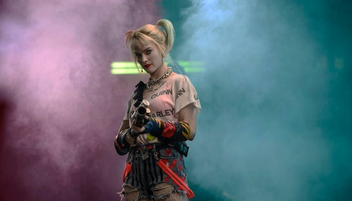

# Grab-cut_segmentation

GrabCut is one of the popular segmentation methods that accurately segment the foreground of the image from the background.
Although it is a traditional computer vision technique, GrabCut outperforms the modern deep learning segmentation methods by blending with deep learning techniques that allows to clean up the segmentation masks and give accurate results.

OpenCV has an implementation of GrabCut - cv2.grabCut() - which simplifies this process of segmentation.

## Procedure

- Provide the image for GrabCut segmentation (along with the destination path for saving the output later).

- Here, GrabCut is implemeted by initialising with bounding boxes. This can be done in many ways. Here, we chose interactive mouse-click drag-and-drop option. So, pressing the right key, drag a rectangle from top left corner towards bottom right of the foreground object on the image. Upon releasing, the image is segmented partially, focusing the selected foreground object. A mask corresponding to the GrabCut is created.

  

- Now perform the adjustments, i.e create a clear-cut mask by choosing one of the following options at a time and pressing the left key:
1. Key 0 for Definite Background (red colour)
2. Key 1 for Probable Background (red colour)
3. Key 2 for Definite Foreground (blue colour)
4. Key 3 for Probable Foreground (blue colour)

After each operation, release the keys.

  

- When done with the refinement, the final mask and the segmented result is displayed by pressing the key 'n'.

  

- To reset all the changes, press 'r'.

- To save/extract the segmented mask/foreground object, press the key 's'.

- Press the key 'q'to quit.

## References
- https://www.pyimagesearch.com/2020/07/27/opencv-grabcut-foreground-segmentation-and-extraction/
- https://github.com/opencv/opencv/blob/master/samples/python/grabcut.py